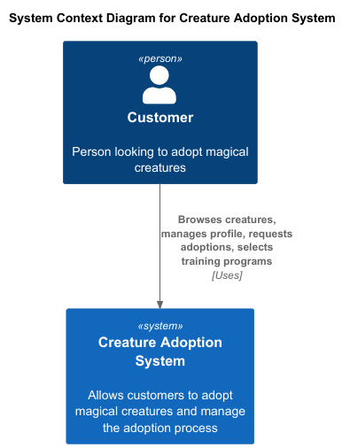
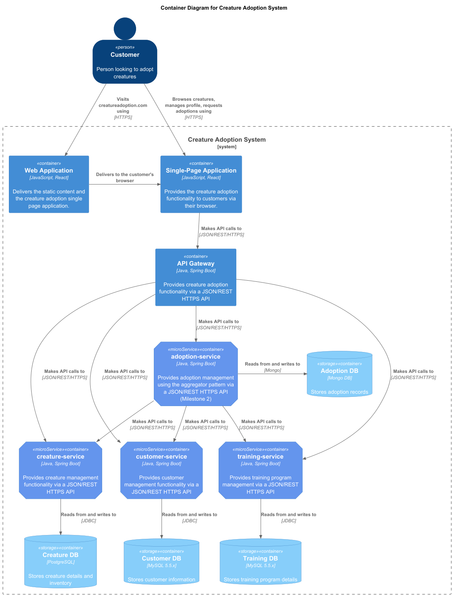
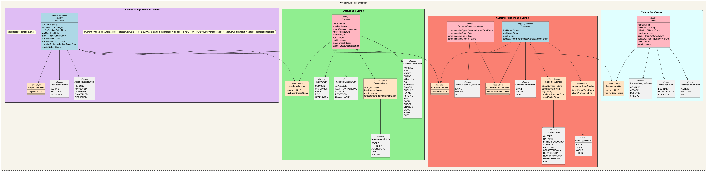

# Creature Adoption System

A microservices-based application that allows customers to adopt magical creatures, manage their profiles, and enroll creatures into training programs. This project was built for the **Web Services and Distributed Computing (420-N45-LA)** course.

---

## Overview

The Creature Adoption System lets customers:

- Create and manage their own profile (name, email, etc.)
- Browse available and unavailable creatures
- Submit adoption requests
- Enroll adopted creatures into training programs

From a technical standpoint, the project demonstrates:

- Microservices architecture with **Spring Boot**
- An **API Gateway** that routes requests
- **Domain-Driven Design (DDD)** applied to subdomains
- Multiple databases (PostgreSQL, MySQL, MongoDB)
- Modeling with **C4 diagrams**

---

## Architecture

### System Context (C4 Level 1)
At the highest level, a customer interacts with the Creature Adoption System to browse creatures and request adoptions.



### Container Diagram (C4 Level 2)
The system is composed of a React single-page application (planned), an API Gateway, and four backend microservices.



- **Web Application / SPA (React, JS):** Frontend client for customers (future implementation).
- **API Gateway (Spring Boot):** Routes all API requests through a single entry point (port 8080).
- **Microservices:**
  - `adoption-service`: Handles adoption lifecycle and aggregates data.
  - `creature-service`: Manages creature data and statuses.
  - `customer-service`: Stores and retrieves customer data.
  - `training-service`: Manages training programs.
- **Databases:**
  - PostgreSQL for creature data
  - MySQL for customer and training data
  - MongoDB for adoptions

### Domain-Driven Design (DDD)
The system is split into subdomains:

- **Adoption Management** – tracks adoption requests and synchronizes creature status.
- **Creature Domain** – maintains creature details and availability.
- **Customer Relations** – manages customer data.
- **Training Domain** – stores and manages creature training sessions.



---

## Features

- Adoption lifecycle:
  - `PENDING → APPROVED → COMPLETED → RETURNED`
- Automatic creature status updates when adoption state changes
- Maximum adoption limit per customer (2 creatures)
- REST APIs for each service, routed through API Gateway
- Docker configuration for containerized deployment

---

## Testing

Testing was performed with **JUnit** and **Spring Test**, with coverage reports generated by **JaCoCo**. Each microservice includes:

- Positive and negative path tests
- Repository integration tests
- Controller integration tests
- Unit tests for controllers and services

Average coverage: ~90%

---

## How to Run

### Prerequisites
- Java 17
- Gradle
- Docker Desktop installed and running

### Build and Test
```bash
./gradlew clean build
./gradlew test
